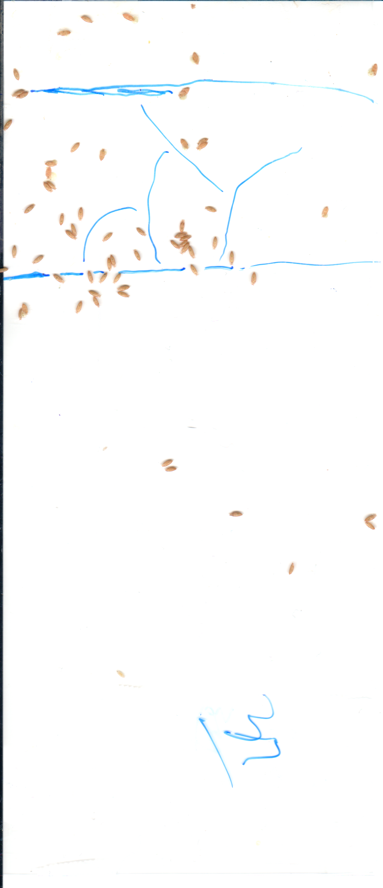
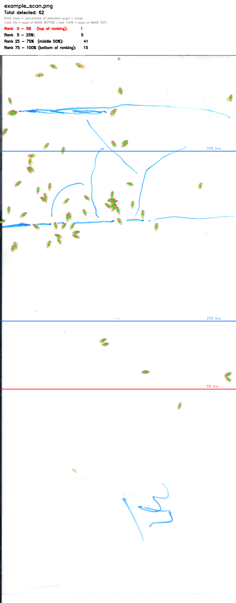
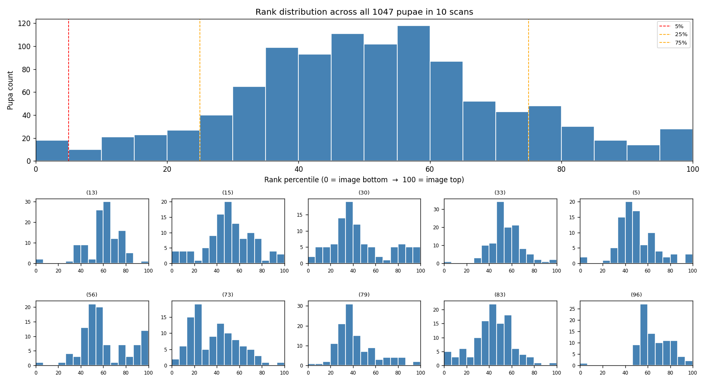

# Pupa Counter

Long Lab silkworm-pupa counter — a single monorepo containing the
desktop Electron app, the Python inference daemon, and the trained
LiDE 300 v3 model. The packaged Windows installer ships everything
self-contained (no system Python or sibling repos needed).

**Current ship (v0.4.0, 2026-05-18):** v3 CNN + GBM classifier
trained on **109 hand-audited LiDE 300 scans / 10,712 labels**.
Honest 10-scan hold-out F1 = **98.7 %** (recall 98.5 %, precision 99.0 %).

## What it does

A 300 dpi LiDE flatbed scan of a pupa sheet → CNN heatmap regression →
peak extraction → 11-feature GBM classifier filter → annotated overlay
+ per-band counts (top 5 % / 5-25 % / middle 50 % / 75-95 % / bottom 5 %).

| raw scan | counted overlay |
|---|---|
|  |  |

The CLI's `--json-out` produces a height-distribution chart for each scan:



## Desktop app

The Electron front-end wraps the daemon — drive the LiDE 300 from a
button, auto-count every scan, drag-edit any mis-detections, save per
session to JSON, export CSV / xlsx for downstream analysis.


## Pipeline

```
   physical paper                    auto-detect best torch backend
   on scanner glass                  per-machine (CUDA / MPS / XPU /
        │                            DirectML / CPU)
        ▼                                       │
  ┌──────────────────┐    PNG     ┌──────────────────────┐
  │  WIA via Power-  │──────────► │  Python daemon       │
  │  Shell COM       │            │  pupa_counter_lide   │
  │  (Win 10/11)     │            │  300_v3.pt + GBM clf │
  └──────────────────┘            └──────────┬───────────┘
                                             │ JSON-lines
                                             ▼
                                    ┌──────────────────┐
                                    │ Electron + React │
                                    │ canvas + manual  │
                                    │ correct + CSV    │
                                    │ export           │
                                    └──────────────────┘
```

## Repo layout

```
pupa-counter/
├── electron/           Electron main process (window, IPC, daemon spawn,
│                       WIA scanner integration, session persistence)
├── src/                React + Zustand UI — canvas, edit tools, sidebars
├── daemon/             Python inference subproc
│   ├── pupa_counter.py         CLI (single image, batch, --json-out)
│   ├── pupa_counter_daemon.py  Persistent JSON-lines worker
│   ├── model/                  Trained checkpoints
│   │   ├── pupa_counter_lide300.pt        (v3 ship, 300 dpi)
│   │   ├── peak_filter_clf_lide300.pkl    (v3 GBM filter)
│   │   ├── pupa_counter_v12.pt            (1200 dpi fallback)
│   │   └── peak_filter_clf_v6_md5.pkl     (v12 companion)
│   ├── scripts/                setup_venv.py for the dev venv
│   ├── examples/               sample scan + counted overlay + xlsx
│   └── README.md               Detailed daemon / CLI docs
├── data/               Accuracy proof for v3 ship
│   ├── labels_109_audited.json    Gold labels (10,712 sure points)
│   ├── stats/                    per-scan CSV + figures
│   └── v3_ship_config.json       Machine-readable contingency result
└── resources/          Icons, packaging assets
```

## Run

### Dev mode (Mac / Linux / Windows)

```bash
cd daemon && python scripts/setup_venv.py    # auto-picks XPU/CUDA/MPS/CPU torch wheel
cd .. && npm install
npm run dev                                  # vite + electron concurrently
```

### Packaged installer

```bash
npm run package:win   # NSIS installer (~1.1 GB, bundles python-runtime)
npm run package:mac   # .dmg (un-signed)
```

The packaged build embeds:
- Pruned Python 3.11.9 + torch + opencv + skimage + sklearn site-packages
- Intel oneAPI runtime (so the same exe gets XPU on Arc machines)
- LiDE 300 v3 model + classifier
- All daemon source

See [`BUILD_INSTALLER.md`](BUILD_INSTALLER.md) for the full Windows build
recipe (where the hand-built `daemon/python-runtime/` tree lives on the
lab machine, release-upload workflow, what happens to user data when a
new installer overwrites an old one).

## Inference defaults

| key | value | meaning |
|---|---:|---|
| `PUPA_MODEL_PATH` | `model/pupa_counter_lide300.pt` | v3 CNN |
| `PUPA_CLF_PATH` | `model/peak_filter_clf_lide300.pkl` | v3 GBM |
| `PUPA_PEAK_THR` | 0.50 | `peak_local_max(threshold_abs=...)` |
| `PUPA_MIN_DIST` | 3 | `peak_local_max(min_distance=...)` |
| `PUPA_BBOX_CROP` | 1 | restrict to high-heat blob region |
| `PUPA_CLF_PROB_THR` | 0.50 | 2nd-stage classifier acceptance |

All env-var overridable. See [`daemon/README.md`](daemon/README.md) for
the full daemon JSON protocol + 11-feature classifier recipe.

## v3 evaluation

10-scan honest hold-out (1,059 labels), evaluated by the v3 contingency
sweep:

| Stage | VAL F1 | P | R |
|---|---:|---:|---:|
| CNN solo (thr=0.5, bbox=on) | 98.18 % | — | — |
| + GBM classifier filter | **98.72 %** | 99.0 % | 98.5 % |

Per-scan miss count averages **1.6 / scan** (down 38 % from v0.3.x's
2.6 / scan). 88 % of remaining misses are pupae <8 px from a sibling
— the architectural floor at σ = 2 in the heatmap regression.

See [`data/stats/summary.txt`](data/stats/summary.txt) +
[`data/stats/`](data/stats/) for the full dataset distribution
(top 5 % / 5-25 % / middle 50 % / 75-95 % / bottom 5 % bands per scan,
y-position density, count histograms).

## Provenance / history

This repo merges what used to be split across separate repos as of 2026-05-18:

| Old repo | Status | Tag preserved |
|---|---|---|
| `pupa_counter_desktop` | now this repo (renamed `pupa-counter`) | `pre-consolidation-2026-05-18` |
| `pupa_counter_v6` | archived → became `daemon/` here | `pre-consolidation-2026-05-18` |
| `pupa_counter` (V12 1200 dpi era) | archived | `pre-consolidation-2026-05-18` |
| `pupa-counter-agent` (cellpose v0 experiment) | archived | `pre-consolidation-2026-05-18` |

Research / training stack (private to the lab):
[`pupa_counter_research_handoff`](https://github.com/sgaofen/pupa_counter_research_handoff)
— training scripts, labeling GUIs, audit data, per-scan diagnostics.
See `HOW_TO_RETRAIN.md` there for the recipe that produced
`pupa_counter_lide300.pt`.
