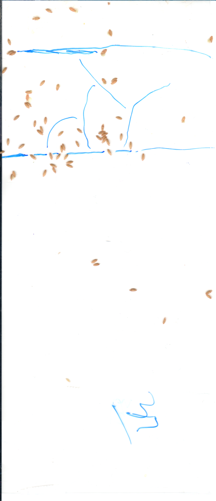
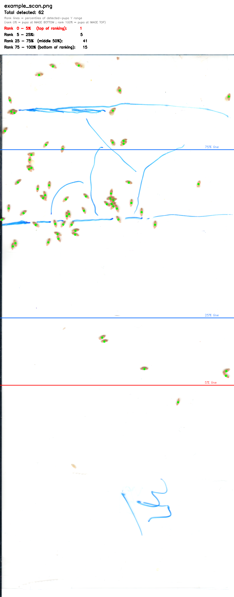
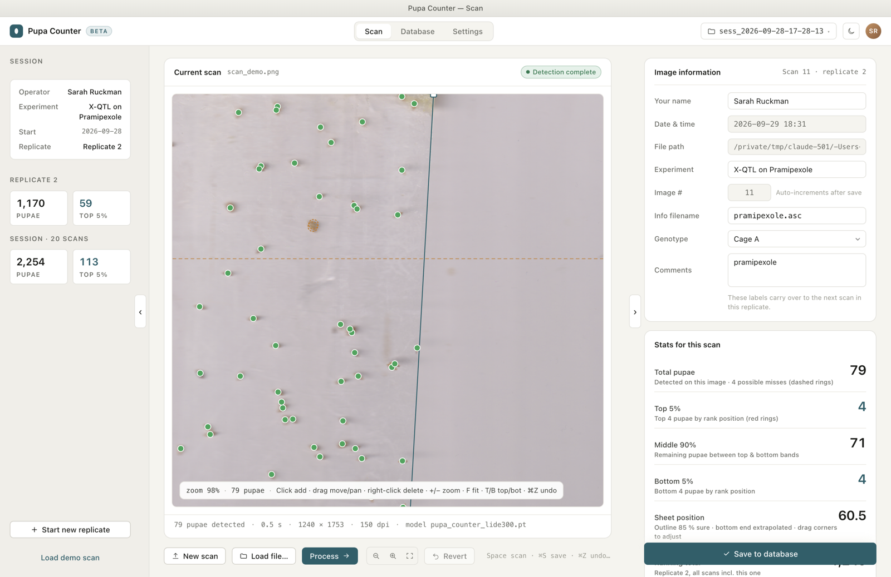

# Pupa Counter

Long Lab *Drosophila* pupa counter — a single monorepo containing the
desktop Electron app, the Python inference daemon, and the trained
Canon LiDE 300 model. The packaged Windows installer ships everything
self-contained (no system Python or sibling repos needed).

**v0.5 (2026-09):** same app, finished details — scans are grouped by
*replicate*, labels carry over between scans, running totals for all pupae
and for the top 5 %, sheet outline + per-pupa sheet position, one-click
CSV / Excel export, macOS scanning, and a DPI guard for the model. See [What changed in v0.5](#what-changed-in-v05).

**Model:** LiDE 300 v4 CNN + GBM classifier (fine-tuned on 162 Top
Offspring + 109 hand-audited LiDE 300 scans).

## What it does

A flatbed scan of a pupa strip → CNN heatmap regression → peak
extraction → 11-feature GBM classifier filter → one dot per pupa, rank
bands (0–5 / 5–25 / 25–75 / 75–100 % of the pupa y-range), the top 5 %
by count, and each pupa's position along the sheet (0 = bottom end,
100 = top end).

**Resolution, for the record:** every scan the lab collected up to
September 2026 is really **150 DPI** (1240 × 1753 A4). The old WIA script
asked for 300 DPI but the request failed silently, and the model was
trained on those 150 DPI scans. v0.5 checks the DPI the scanner actually
delivers, warns when it differs from what was requested, and resizes any
non-150 DPI image to the model's training DPI before counting
(coordinates are mapped back to the original pixels).

| raw scan | counted overlay |
|---|---|
|  |  |

## Desktop app

| before (v0.4) | after (v0.5) |
|---|---|
|  |  |

Daily loop: put a sheet on the glass → **New scan** (or **Space**) → check
and correct the dots → **Save to database** (**⌘/Ctrl-S**) → next sheet.
Starting the next scan also saves a finished, unsaved scan, so nothing is
lost if you forget to click Save.

- **Scan** — left: session card plus running totals of pupae and of the
  top 5 % for the current replicate and for the whole session;
  *Start new replicate*. Centre: the scan with model dots (green), added
  dots (teal), top-5 % rings (red), possible misses (dashed, click to
  accept), rank lines and the sheet outline with draggable corners; a
  notice appears when the scanner delivered a different DPI than asked or
  the sheet outline needs checking. Right: image information (genotype menu
  from Settings plus *Other…*, info filename, comments — carried over to
  the next scan of the same replicate) and the stats card, including the
  mean sheet position and both running totals. Click adds, drag moves a
  dot or pans, right-click deletes, wheel zooms, **⌘/Ctrl-Z** undoes.
- **Database** — every saved scan with running totals per replicate, the
  per-pupa table (x, y, rank %, band, sheet %, source) for the selected
  scan, and one-click exports: *Scans CSV*, *Per-pupa CSV*, *Excel*. The
  file is revealed in Explorer / Finder after export.
- **Settings** — scanner, resolution, color mode, the genotype list (add /
  rename / reorder / remove), default operator, and where session data,
  scans and exports live (with *Open*), plus model info.

Before / after screenshots of each page: [`docs/screenshots/v0.5/`](docs/screenshots/v0.5/).

## Pipeline

```
   plastic strip                     auto-detect best torch backend
   on scanner glass                  (CUDA / MPS / XPU / DirectML / CPU)
        │                                       │
        ▼                                       ▼
  ┌──────────────────┐    PNG     ┌───────────────────────────────┐
  │ Windows: WIA via │──────────► │ Python daemon                 │
  │   PowerShell COM │  + actual  │  resize to manifest trainDpi  │
  │ macOS: icscan    │    DPI     │  CNN + GBM → pupae            │
  │   (ImageCapture) │            │  sheet_detect → outline       │
  └──────────────────┘            └──────────────┬────────────────┘
                                                 │ JSON-lines
                                                 ▼
                                  ┌───────────────────────────────┐
                                  │ Electron + React              │
                                  │ edit · auto-save per replicate│
                                  │ CSV / xlsx export             │
                                  └───────────────────────────────┘
```

## Repo layout

```
pupa-counter/
├── electron/              Electron main process
│   ├── main.js            window, IPC, daemon spawn, sessions, export
│   ├── preload.js         renderer API
│   ├── tour.js            screenshot tour (dev only, PUPA_TOUR=…)
│   └── scanner/
│       ├── wia_list.ps1, wia_scan.ps1   Windows WIA
│       └── mac/icscan.swift             macOS ImageCaptureCore CLI
├── src/                   React + Zustand UI
│   ├── pages/             ScanView, DatabaseView, SettingsView
│   ├── components/        EditCanvas, TopNav, SessionPicker, …
│   ├── store/             session + workstation settings stores
│   └── lib/               bands, sheetPct, sessionSchema, exporters
├── daemon/                Python inference subprocess
│   ├── pupa_counter.py            CLI (single image, batch)
│   ├── pupa_counter_daemon.py     persistent JSON-lines worker
│   ├── sheet_detect.py            sheet outline detector
│   └── model/
│       ├── manifest.json                  model file, classifier, trainDpi, thresholds
│       ├── pupa_counter_lide300.pt        LiDE 300 v4 CNN (trained at 150 DPI)
│       ├── peak_filter_clf_lide300.pkl    matching GBM filter
│       ├── pupa_counter_v12.pt            legacy (pre-LiDE scanner)
│       └── peak_filter_clf_v6_md5.pkl     legacy companion
└── data/                  accuracy proof for the v3 ship
```

## Run

### Dev mode (Mac / Linux / Windows)

```bash
cd daemon && python scripts/setup_venv.py    # auto-picks XPU/CUDA/MPS/CPU torch wheel
cd .. && npm install
npm run build:icscan                         # macOS only: builds the scanner CLI
npm run dev                                  # vite + electron
```

`PUPA_PYTHON=/path/to/python` points the app at another Python
environment. On macOS the app compiles `icscan` into its data folder on
first scan if `npm run build:icscan` wasn't run (needs the Xcode command
line tools).

### Packaged installer

```bash
npm run package:win   # NSIS installer (~1.1 GB, bundles python-runtime)
npm run package:mac   # .dmg (unsigned), includes icscan
```

See [`BUILD_INSTALLER.md`](BUILD_INSTALLER.md) for the Windows build
recipe and what an upgrade does to user data.

## Data and files

- **Sessions:** one JSON file per session in `<userData>/sessions/`
  (Windows `%APPDATA%\pupa-counter\sessions\`). Written after every change
  (atomic write). Settings → *Defaults & data* shows and opens the folder.
- **File format:** v0.5 writes `schemaVersion: 2` but keeps the original
  key names (`rounds`, `roundId`, `roundNumber` = replicate) so older
  versions can still open the files. New per-scan fields: `top5Selected`,
  `requestedDpi`, `actualDpi`, `dpiSource`, `trainDpi`, `inferenceScale`,
  `sheet` (corners, confidence, `manual`), per-pupa `sheetPct`, `score`,
  `prob`. Before the first v0.5 write to an older file, the original is
  copied to `sessions/_backup_before_v0.5/`.
- **Scans:** PNGs in `<userData>/scans/` or the folder chosen in Settings.
- **Exports:** `Documents/Pupa Counter Exports/` or the folder chosen in
  Settings. Columns are listed in `src/lib/exporters.ts`.

## Inference defaults

From `daemon/model/manifest.json`; every value can be overridden with an
env var before launching the app.

| key | value | meaning |
|---|---:|---|
| `trainDpi` / `PUPA_TRAIN_DPI` | 150 | images at other DPIs are resized to this |
| `PUPA_MODEL_PATH` | `model/pupa_counter_lide300.pt` | CNN |
| `PUPA_CLF_PATH` | `model/peak_filter_clf_lide300.pkl` | GBM |
| `PUPA_PEAK_THR` | 0.50 | `peak_local_max(threshold_abs=...)` |
| `PUPA_MIN_DIST` | 3 | `peak_local_max(min_distance=...)` |
| `PUPA_BBOX_CROP` | 1 | restrict to high-heat blob region |
| `PUPA_CLF_PROB_THR` | 0.50 | 2nd-stage classifier acceptance |

The image DPI comes from the scanner when scanning; for imported files it
is inferred from the pixel size (A4 / LiDE bed), then PNG metadata, and
otherwise assumed to be `trainDpi`.

## What changed in v0.5

- Same layout and look as v0.4; "Round" is now **replicate** everywhere
  in the UI and exports (files keep the old keys, see above).
- Labels (genotype, operator, experiment, comments, info filename) carry
  over within a replicate; a new replicate or session resets them.
  The genotype list is editable in Settings (default list adds *Cage A-1*
  and *Cage A-2*); *Other…* lets you type any value.
- Running totals for the top 5 % next to the pupa totals (replicate and
  session).
- Sheet outline detection, draggable corners, per-pupa `sheetPct`.
- An unsaved finished scan is saved automatically when the next scan starts.
- One-click exports (scan summary CSV, per-pupa CSV, xlsx) revealed in the
  file manager.
- **Bug fix:** `wia_scan.ps1` swallowed the resolution error (and set the
  intent after the resolution, which resets it on the LiDE 300 driver).
  It now sets properties by WIA ID in the right order, reads them back and
  reports `requestedDpi` / `actualDpi`; the UI warns on a mismatch.
- macOS scanning through ImageCaptureCore (`electron/scanner/mac`).
- DPI guard in the daemon, driven by the model manifest.

## v3 evaluation

10-scan honest hold-out (1,059 labels), evaluated by the v3 contingency
sweep:

| Stage | VAL F1 | P | R |
|---|---:|---:|---:|
| CNN solo (thr=0.5, bbox=on) | 98.18 % | — | — |
| + GBM classifier filter | **98.72 %** | 99.0 % | 98.5 % |

See [`data/stats/summary.txt`](data/stats/summary.txt) for the dataset
distribution.

## Provenance / history

This repo merges what used to be split across separate repos as of 2026-05-18:

| Old repo | Status | Tag preserved |
|---|---|---|
| `pupa_counter_desktop` | now this repo (renamed `pupa-counter`) | `pre-consolidation-2026-05-18` |
| `pupa_counter_v6` | archived → became `daemon/` here | `pre-consolidation-2026-05-18` |
| `pupa_counter` (V12, pre-LiDE scanner) | archived | `pre-consolidation-2026-05-18` |
| `pupa-counter-agent` (cellpose v0 experiment) | archived | `pre-consolidation-2026-05-18` |

Research / training stack (private to the lab):
[`pupa_counter_research_handoff`](https://github.com/sgaofen/pupa_counter_research_handoff).
